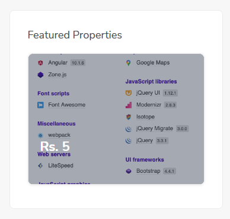
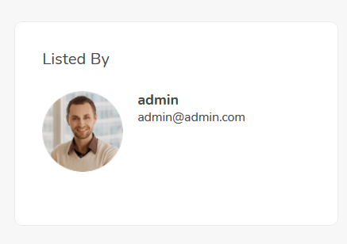
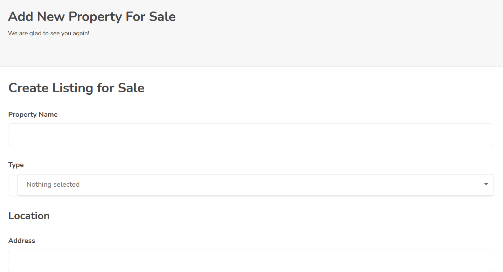
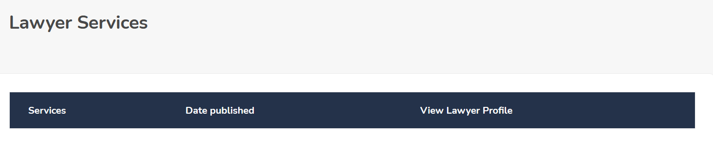

# Ecommerce Angular Frontend

| Project Title : **Ecommerce**                      Prepared By : **Prabhat Joshi** |
| --- |

### **Product Characteristics and Requirements:**

1. Secure MySQL database.
2. Token based authentication
3. OTP based twilio verification
4. different user roles and type.
5. login, logout, register etc.
6. Product listing and review System.
7. Easy to use and User intuitive Interface.

### **Project Management Deliverables:**  

    Project plan, Research finding report, Work breakdown structure, Scope statement, Project charter, Training manuals, lessons learned report etc., **Product-related deliverables:**         Design documents, software code, project documentation and tips on its operation.,   |

## **Statement of Work**

1. Scope of Work

    This project5 is meant to make the users and new residents life a breeze by helping them search places near them that are available to buy/rent. It&#39;s main goal is to reduce the gap between the sellers and buyers and provide a much better experience to the house seekers. It also helps the dealer and the rental company to reach their target audience more efficiently and effectively.

2. Acceptance Criteria:

    The acceptance criteria for the users are

    * The website has to communicate with the database.

    * Users can easily login and register to the site

    * Owners, Dealers and Lawyers can easily put their listing and provide their services.

    * Site owners and administrators can easily administer the site.

    * Company Members can easily manage the working and issues of users.

    * Maintaining the account details of the user.

    * Users can view the available places to rent/buy through online, and review the properties,.

## **Project Design Document**

### **Introduction**

    The project is based on two widely known frameworks, **Angular** that is based on typescript and **Laravel** that is based on php. For Database **MySQL** is used. The frameworks and the database used are based on industry standards and can be scaled via load balancers to handle heavy amounts of traffic resulting in less downtime leading to more profitability and good reputation in the market.

### **Purpose**

    For frontend Angular is used as it provides single page routing that results in a very responsive site. It also helps the different components of a site to be developed independently giving a more independent work approach on the project resulting in higher customisability.

    The backend is built up using Laravel as it has amazing sets of modules that makes API development and scalability of the site a breeze. The modules used in Laravel are passport authentication that provides wonderful features as token-based authentication making our site bulletproof against the hackers. It uses OTP based authentication system via Twilio phone number verification API which prevents repetitive account creation and false users from registering. Laravel also has a database migrate feature which does not require database dump to deploy site on systems, resulting in ease of development and less setup time among the developers.

    This project implements User login, logout, Dashboard for all types of users ranging from admin all the way to the customers, product listing and review system, various user intuitive features, and user register with a Phone number verification support.

### **Scope**

    This project is being developed for the house seekers who are planning to buy a house or rent an existing one in a particular city.

### **Intended Audience**

    This document is intended for use by technical developers. This document also includes sections relevant to the operational and maintenance group.

    * The intended audiences for this document are:
    * The owner of this project.
    * The team members of the company that is registered.
    * The administrative staff of the company that this project is sold to.
    * The future Developer that may work on the project

## **System Architecture: The Three Tier Architecture:**

    To develop this project, the architecture that we are implementing is Three Tier Architecture. The Frontend, Backend and Data Storage Layer together called as Three Tier Architecture.

### **Frontend**

    The Frontend is built up using Angular that has amazing features that makes user interaction and logic implementation a breeze thanks to its single page routing model. All the logics that require manipulation of data on client&#39;s side are handled here.

### **Backend**

    The Backend is handled by Laravel that will give secured access to the database that is used. It also gives us the freedom to develop wide application logics on server side without compromising the security model of the project.

### **Data Storage Layer**

    The Data Storage Layer will record all information required by the APIs developed in the backend. This data will include the details of the house/apartment, the general user and admin user information and much more. All passwords stored in the database will be encrypted to prevent unauthorized access. Within the Data Storage Layer, a collection of SQL Queries will provide access to the data in a meaningful way.

## **Architectural Design**

### **Frontend Pages:**

#### **Name: Home Page**                                        **URL: (site\_url)/**

**Description** :

    First page contains the welcome message as well as the navigation buttons to direct the user to other pages. First page consists of house listing, contact, login/register, Advanced Search and search. login/register is continuously changing depending upon the login state of user.

Operations:

            Pre-condition: Connected to site

            Post-condition: presents another page

            Exceptions: None

#### **Features** :

    Property Search

    3 newly added property listings

    Click to Search in popular cities:

    Firm goals section

    Partners Section

    Agent register Section

    Footer Section

#### **Name: Product listing Page**                              URL: (site\_url)/productlisting

Description:

    This page has list that lists the properties available on the site. It has featured list on the left side that shows the recent five properties.

            Pre-condition: Connected to site

            Post-condition: presents another page

            Exceptions: None

    Listing

    Featured list

    Result counter

#### **Name: Product detail Page**                               URL: (site\_url)/productpage

Description:

    This page displays the details of the property selected in the property lists page. It has review system integrated which allows authenticated users to post review on the site.

            Pre-condition: Connected to site

            Exceptions: None

    Property Images

    Property Detail Section

    Lisiting Creator Detail Section

    Review Section

    Review Display

    Location Module

#### **Name: login page**                                       URL: (site\_url)/login

Type: Angular page

Description:

        If the user wants to check their account details, it can be done with the help of login page. Whenever login/register button is clicked it asks the user login name and password, if the login name and password is valid the user is presented with _2 options profile and logout_(For Customers) &amp; _3 options Dashboard, profile and logout(For other Users)_.

    Operations:

                Pre-condition: Connected to site

                Post-condition: Click on link presents another page

                Exceptions: None

    Login Credential Form

#### **Name: User Register Page**                                URL: (site\_url)/register

Type: Angular page

Description:

    This page allows the user to register to the site.

                Pre-condition: Connected to site

                Post-condition: presents another page

                Exceptions: None

    Register Form

    OTP Form

#### **Name: Seller Register Page**                                 URL: (site\_url)/contact

Description:

    This page helps Seller and lawyers register.

                Pre-condition: Connected to site

                Post-condition: presents another page

                Exceptions: None

    Owner register

    Lawyer Register

    Dealer/Company Register

    OTP Form

#### **Name: Profile Page**                                   URL: (site\_url)/Dashboard

Description:

    This page shows the user details, Button for changing user details and password change form:

                Pre-condition: Connected to site

                Post-condition: Shows Details

                Exceptions: None

    Information Section

    Verification Status Section

    Password Change Section

    Change Details Section

#### **Name: Contact Page**                                   URL: (site\_url)/contact

Type: Angular page

Description:

    This page shows the contact details and helplines in case user is facing any issues.

                Pre-condition: Connected to site

                Post-condition: presents another page

                Exceptions: None

    Detail Section

    Phone/Social details Section

#### **Name: Testimonial Page**                               URL: (site\_url)/testimonials

Type: Angular page

Description:

    This page shows the Members of the team.

                Pre-condition: Connected to site

                Post-condition: presents a gallery type section.

                Exceptions: None

#### **Name: Property Listing Page**                           URL: (site\_url)/insertproduct

Type: Angular page

Description:

    This page shows the contact details and helplines in case user is facing any issues.

                Pre-condition: Connected to site

                Post-condition: presents another page

                Exceptions: available for all users except customer

    Selector

    Sale Creation Form

    Rent Creation Form

#### **Name: Saved Search Page**                              URL: (site\_url)/savedsearches

Type: Angular page

Description:

    This page shows the saved searches of users. It is stored when the user is logged in.

                Pre-condition: Connected to site

                Post-condition: presents another page

                Exceptions: None

#### **Name: My Properties Page**                                 URL: (site\_url)/contact

Type: Angular page

Description:

    This page shows properties added by user, has edit and delete option.

                Pre-condition: Connected to site

                Post-condition: presents another page

                Exceptions: Available for all users except customer

#### **Name: Review Page**                                     URL: (site\_url)/reviews

Description:

    This page shows the reviews given.

                Pre-condition: Connected to site

                Post-condition: presents another page

                Exceptions: None

#### **Name: Requirement Page**                               URL: (site\_url)/requirements

Type: Angular page

Description:

    This page helps to post any requirements.

                Pre-condition: Connected to site

                Post-condition: presents another page

                Exceptions: None

    Post form

#### **Name: Lawyer Page**                                     URL: (site\_url)/lawyers

Type: Angular page

Description:

    This page shows the contact details and services of lawyers .

                Pre-condition: Connected to site

                Post-condition: presents another page

                Exceptions: None

#### **Name: Lawyer Service Page**                              URL: (site\_url)/lawyerservice

Description:

    This page helps lawyer manage his service listing details.

                Pre-condition: Connected to site

                Post-condition: presents another page

                Exceptions: available only for lawyers

#### **Name: loan Calculator Page**                                  URL: (site\_url)/loanclac

Type: Angular page

Description:

    This page helps users calculate loan amount and various loan related parameters.

                Pre-condition: Connected to site

                Post-condition: presents another page

                Exceptions: Only for users

    Calculate form

    Interest rate section

### **ADMIN PAGES**

#### **Name: Dashboard Page**                                   URL: (site\_url)/dashboard

Description:

    This link only shows for users other than customers. It gives essential information regarding listing and other stuffs.

                Pre-condition: Connected to site

                Post-condition: presents Stats

                Exceptions: not for customer(Hybrid and changes with logged in user roles)

    Stat Section

    Activity Section

####  **Name: All Users Page**                                    URL: (site\_url)/adminusers

Description:

    This page shows the list of all users and option to edit and delete it.

                Pre-condition: Connected to site

                Post-condition: presents another page

                Exceptions: only for company members

    User detail

    User detail edit

#### **Name: All Properties Page**                                URL: (site\_url)/adminproducts

Description:

    This page shows all the properties and various options to manipulate and view it.

                Pre-condition: Connected to site

                Post-condition: presents another page

                Exceptions: only for company members

    Property list

    Edit property

#### **Name: Loan Control Page**                                  URL: (site\_url)/adminloan

Description:

    This page helps company staffs control the loan parameters and list it.

                Pre-condition: Connected to site

                Post-condition: presents another page

                Exceptions: only for company members

    Add loan parameter form

#### **Name: User Creator Page**                                  URL: (site\_url)/usercreator

Description:

    This form gives powers to create any user related to your site.

                Pre-condition: Connected to site

                Post-condition: presents another page

                Exceptions: only for SITE OWNER.

#### **Name: Other Page**                                         URL: (site\_url)/\*

Description:

    These are the pages that rely on their parent pages for functioning .

                Pre-condition: Connected to site

                Post-condition: presents another page

                Exceptions: none

   

## **Database Description**

    The Database for this project consists of 5-6 tables and can be deployed by making a database, editing the credentials in the .env file of the backend and running the following command
 

    php artisan migrate

 

    this will setup the database for the project

### Admin Panel Credentials

    The admin panel can be accessed via following credentials.

    Username: [admin@admin.com](mailto:admin@admin.com)

    Password: 12345678

    It can be changed in the profiles page.

## **Project Requirements Specification**

### *Introduction*

#### **Purpose**

    The main objective of this document is to illustrate the requirements of this project. The document gives the detailed description of the both functional and non-functional requirements of the project

#### **Document Conventions**

    The following are the list of conventions and acronyms used in this document and the project as well:

    - Administrator: A login id representing a user with user administration privileges to the software
    - User: A general login id assigned to most users
    - Client: Intended users for the software
    - Frontend: The section of the assignment referring to what the user interacts with directly.
    - Backend: The section of the assignment referring to the backend. This is where all computations are completed and server-side logics are written.
    - Database: The section of the assignment referring to where all data is stored

#### **Intended Audience and Reading Suggestions**

    The intended audiences for this document are:

    * One who owns the project and is ready to deploy int in production

### **Overall Description**

#### **Product Perspective**

    The **Housing Street Project** is meant to make the users and new residents life a breeze by helping them search places near them that are available to buy/rent. It also helps the dealer and the rental company to reach their target audience more efficiently and effectively.

#### **Product Features**

    There are two different users who will be using this product:

        * Admins, companies and the dealers that will use this project to manage houses

        * House Seeking Users who will be accessing the website.

#### **User Documentation**

    The product will include user manual. The user manual will include product overview, complete configuration of the used software (such as SQL server), technical details, backup procedure and contact information which will include email address. The product will be compatible with all the modern browsers present. The databases will be created in the MySQL.

#### Assumptions and Dependencies

    The product needs following third party product.

    * Online MySQL server to store the database.

    * Shared hosting that supports Laravel and Angular or a secured VPS on which Backend and database server will be deployed

    * Hosting to host frontend.

### **Non Functional Requirements**

#### **Hardware Interfaces**

    **Server Side:**

    * Operating System: Ubuntu or windows-based VPS.

    * Processor: 2 or more vcpus.

    * RAM: 2048 Mb or more

    * Hard Drive: 500 GB or more

#### **Client side:**

    * Operating System: Windows xp or above, MAC or LINUX.

    * Processor: Pentium III or 2.0 GHz or higher.

    * RAM: 256 Mb or more

    * Modern Browser( Safari, Chrome or Firefox) .

#### **4.4. Communications Interfaces**

    The Customer must connect to the Internet to access the Website:

    * Dialup Modem of 52 kbps

    * Broadband Internet

    * Dialup or Broadband Connection with an Internet Provider.

#### Theme was inspired by Renthouse Theme